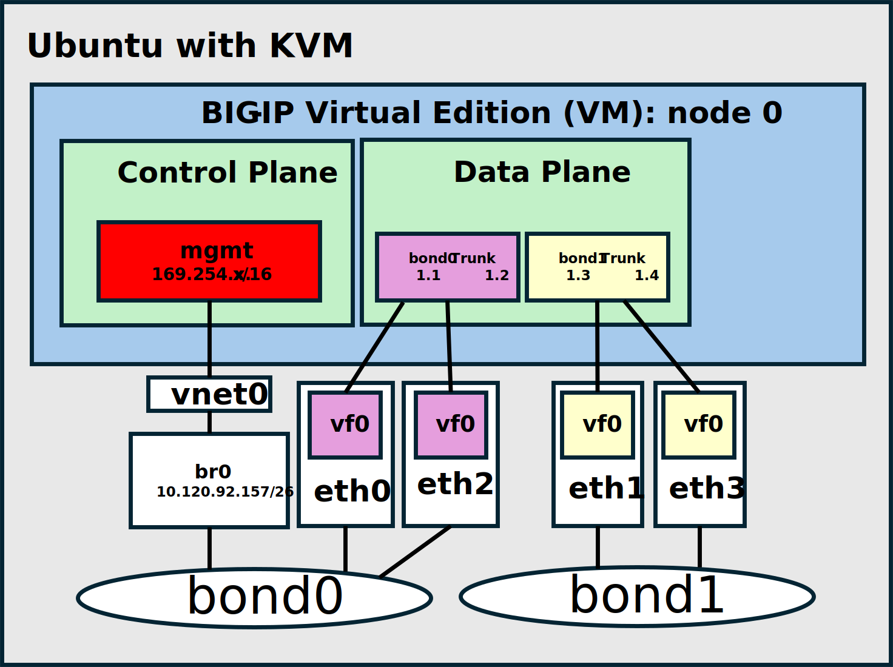

# ibmclassic_bigip_bare_metal_vadc
BIG-IP TMOS Running on IBM Bare Metal Servers for vADC Reference Architecture

This automation can be run as a IBM Classic post provisioning script or as cloudinit user-data.

To generate both of project artifacts:

1) clone the repository

`$ git clone https://github.com/jgruberf5/ibmclassic_bigip_bare_metal_vadc.git`

2) create the post provisioning script and cloud-init userdata artifacts

`$ make`

The artifacts will be generated in a `build` subdirectory of the cloned respository.

| Artifact File  | Mode | Description |
| ------------- | ------------- | ------------- |
| `build/onboarding.sh` | provisioning script | host this script on a public bucket and reference the object URL when provisioning a IBM Classic bare metal server |
| `build/user-data.yaml` | cloud-init user-data | post as user-data for the IBM Classic bare metal server |
| `build/bigip-virtual-edition.deb` | debian package | manually install with `dpkg -i bigip-virtual-edition.deb` |

The automation will generate a `systemd` oneshot service which will assure the appropriate F5 assets are installed and that the standard IBM Classic bare metal service networking is adapted for BIG-IP virtual edition use.



By default HTTPS and SSH traffic are NATed for management access from either the private primary or public primary addresses assigned to the bare metal node. 

HTTP access to the BIG-IP management gui: https://[primary_bare_metal_host_address]
SSH access to the BIG-IP management CLI: ssh -p 2222 root@[primary_bare_metal_host_address]

To disable the NAT access:

```
. /opt/F5Networks/onboarding/installenv
remove_port_forward_management_traffic
```

Access to the BIG-IP console from the bare metal host:

```
virsh console BIG-IP-Virtual-Edition
```

This automation assumes one BIG-IP virtual edition instance per IBM Classic baremetal server.

Before running the `systemd` service you can install varables in a `/etc/bigip` file on the server in `sh` ENV exported variable format. The variables in the file allows you to easily customize the deployment.

Sample install variable ENV file found at `/opt/F5Networks/onboarding/scripts/etc_bigip_sample.txt`.

Install variables:

| Variable  | Default | Description |
| ------------- | ------------- | ------------- |
| TMOS_ADMIN_PASSWORD  | F5Networks! | The initial ssh root account and XUI admin password |
| BIGIP_HOSTNAME | The bare metal host hostname | BIG-IP virtual edition instance hostname |
| BIGIP_MANAGEMENT_IP | generated IPv4 link local address | BIG-IP virtual edition management inteface IP CIDR on the bond0 bridge |
| BIGIP_MANAGEMENT_NEXT_HOP | generated host IPv4 link local address | BIG-IP virtual edition management gateway address |
| BIGIP_MANAGEMENT_MTU | 1460 | BIG-IP virtual edition management interface MTU |
| BIGIP_INSTANCE_ID | bigipinstance1 | user-data CI data instance ID for the BIG-IP virtual edition |
| BIGIP_VM_NAME | BIG-IP-Virtual-Edition | libvirt instance name for the BIG-IP virtual edition |
| BIGIP_VM_MEMORY | 4194304 | Size in KB of the BIG-IP virtual edition RAM |
| BIGIP_VM_VCPUS | 2 | Number of virtual CPUs to allocate to BIG-IP virtual edition |
| BIGIP_VM_IMAGE_DOWNLOAD_PATH | IBM COS 17.5.0-0.0.15 ALL 1SLOT Bucket | Object storage bucket for the BIG-IP virtual edition qcow2 disk image |
| BIGIP_VM_IMAGE_DOWNLOAD_IMAGE_NAME | BIGIP-17.5.0-0.0.15.ALL_1SLOT-031025001.qcow2 | Object storage file for the BIG-IP virtual edition qcow2 disk image |
| BIGIP_VM_IMAGE_DOWNLOAD_IMAGE_MD5 | BIGIP-17.5.0-0.0.15.ALL_1SLOT-031025001.qcow2.md5 | Object storage file for the BIG-IP virtual edition qcow2 md5 hash |
| MANAGEMENT_PORT_FORWARDS | 1 | 0 or 1 to enable or disable TCP port forwarding for 443 to XUI and 2222 to SSH on host br0 and bond1 interfaces for the BIG-IP virtual edition |

Example `/etc/bigip`

```
export TMOS_ADMIN_PASSWORD='SuperSecureF5Password!123'
export BIGIP_MANAGEMENT_IP='10.120.92.159/26'
export BIGIP_MANAGEMENT_NEXT_HOP='10.120.92.129'
export BIGIP_VM_MEMORY=16777216
export BIGIP_VM_VCPUS=8
export BIGIP_VM_IMAGE_DOWNLOAD_PATH='https://s3.us-east.cloud-object-storage.appdomain.cloud/f5-adc-bigip-17.5.0-0.0.15.all-1slot-031025001-us-east'
export BIGIP_VM_IMAGE_DOWNLOAD_IMAGE_NAME='BIGIP-17.5.0-0.0.15.ALL_1SLOT-031025001.qcow2'
export BIGIP_VM_IMAGE_DOWNLOAD_IMAGE_MD5='BIGIP-17.5.0-0.0.15.ALL_1SLOT-031025001.qcow2.md5'
export MANAGEMENT_PORT_FORWARDS=0
```

## Starting and Stop BIG-IP Virtual Edition

To start the BIG-IP: `systemctl start bigip-virtual-edition`

To shutdown the BIG-IP: `systemctl stop bigip-virtual-edition`


## To unistall from a debian package install

```
dpkg -r bigip-virtual-edition
```

## To uninstall manaually from bare metal host shell

```
sh -c /opt/F5Networks/onboarding/uninstall.sh
```